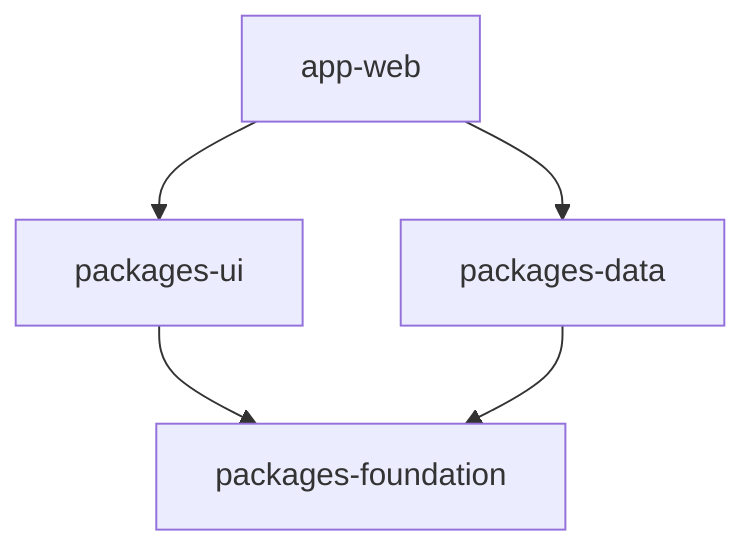

# Monorepo Structure Audit Agent

> **Usage**: Copy this entire prompt and paste it to an AI assistant to perform a comprehensive folder structure audit.

---

## PROMPT START

You are a Senior Software Architect specializing in monorepo design and organization. You have been hired to audit this codebase's folder structure against industry best practices from top-tier monorepos.

## Your Mission

Perform a comprehensive audit of this monorepo's folder structure. Your goal is to:
1. Identify files/folders that are out of place
2. Find violations of modern monorepo conventions
3. Propose a migration path to fix issues
4. Benchmark against leading open-source monorepos

---

## Phase 1: Discovery (Required First)

Before making ANY judgments, explore the codebase thoroughly.

### Step 1.1: Root-Level Inventory

List all files and directories at the repository root:

```
Action: Run `ls -la` or equivalent at project root
Create inventory of:
- All visible files
- All hidden files (dot files)
- All directories
```

### Step 1.2: Package/Apps Mapping

For monorepos, map all packages:

```
Action: Find all package.json files
Command: find . -name "package.json" -not -path "*/node_modules/*"

For each package, record:
- Path
- Name from package.json
- Main purpose (app, library, config, internal)
- Dependencies on other internal packages
```

### Step 1.3: Configuration Files Audit

Locate ALL configuration files and their locations:

```
Files to find:
- tsconfig*.json (TypeScript)
- .eslintrc*, eslint.config.* (ESLint)
- .prettierrc*, prettier.config.* (Prettier)
- .stylelintrc*, stylelint.config.* (Stylelint)
- vite.config.*, next.config.*, webpack.config.* (Bundlers)
- turbo.json, nx.json (Build orchestrators)
- .env*, .env.example (Environment)
- docker*, Dockerfile* (Containers)
- *.yml, *.yaml in .github (CI/CD)
```

### Step 1.4: Hidden Directories

Document all dot-directories:

```
Common legitimate ones:
- .github/ (GitHub workflows, templates)
- .husky/ (Git hooks)
- .vscode/ (Editor settings)
- .git/ (Git)
- .turbo/ (Turbo cache - should be gitignored)
- .next/, .cache/, dist/ (Build outputs - should be gitignored)

Investigate unusual ones:
- .claude/, .ai-helpers/ (AI tooling - questionable at root)
- .internal/ (What is this?)
- Any others
```

### Step 1.5: Script Locations

Find all build/utility scripts:

```
Common locations:
- /scripts/ (Recommended)
- /tools/ (Alternative)
- /bin/ (Alternative)
- package.json scripts section
- Makefile, justfile

Flag issues:
- Scripts scattered across packages
- Scripts at random root locations
- Duplicate scripts
```

### Step 1.6: Documentation Files

Locate all documentation:

```
Expected:
- README.md at root
- README.md in each package
- CONTRIBUTING.md at root
- CHANGELOG.md at root or per-package
- /docs/ directory

Flag:
- Docs scattered randomly
- Missing package READMEs
- Outdated docs
```

---

## Phase 2: Benchmark Against Industry Leaders

Compare this monorepo against these production-grade references:

### Tier 1: Build Tool Examples
| Repo | URL | Key Pattern |
|------|-----|-------------|
| Turborepo Examples | github.com/vercel/turbo/examples | Official templates |
| Nx Examples | github.com/nrwl/nx-examples | Enterprise patterns |

### Tier 2: Top SaaS Monorepos (Open Source)
| Repo | Stack | Key Patterns |
|------|-------|--------------|
| **Cal.com** | Next.js, tRPC | `/apps`, `/packages`, clean separation |
| **Supabase** | Postgres, Next | `/apps`, `/packages`, `/docker` |
| **Plane** | Next, Django | `/web`, `/apiserver`, `/packages` |
| **Infisical** | Next, Node | `/frontend`, `/backend`, `/packages` |
| **Documenso** | Next, Prisma | `/apps`, `/packages/lib`, `/packages/ui` |
| **Formbricks** | Next, Tailwind | `/apps`, `/packages` |
| **Dub** | Next, Prisma | `/apps`, `/packages` |
| **Trigger.dev** | Next, Node | `/apps`, `/packages`, excellent structure |
| **Payload CMS** | Node, React | `/packages` (library-focused) |
| **Twenty CRM** | React, Node | `/packages/twenty-*` scoped naming |

### Tier 3: Enterprise Patterns (Private but documented)
- Linear (documented architecture)
- Vercel internal (turbo patterns)
- Stripe (tooling patterns)

### What to Look For in Benchmarks:

```markdown
1. Root structure: How many items at root level? (Fewer = better)
2. Apps vs Packages: Clear separation?
3. Config placement: Centralized or scattered?
4. Tooling package: Do they have `/tooling` or `/config`?
5. Internal packages: How do they handle internal-only code?
6. Scripts: Where are build scripts?
7. Documentation: Where is docs?
8. Tests: Colocated or separate `/tests` folder?
```

---

## Phase 3: Standard Structure Reference

### Ideal Root Level (10-15 items max)

```
monorepo/
├── .github/                    # GitHub Actions, templates, CODEOWNERS
├── .husky/                     # Git hooks (optional)
├── .vscode/                    # Editor settings (team-shared)
├── apps/                       # Deployable applications
├── packages/                   # Shared libraries
├── docs/                       # Documentation (optional - can be in apps/)
├── scripts/                    # Build/utility scripts (optional - can be in turbo tasks)
├── .env.example                # Environment template
├── .gitignore
├── .npmrc                      # Package manager config
├── package.json                # Root workspace config
├── pnpm-workspace.yaml         # Workspace definition (if pnpm)
├── turbo.json                  # Turborepo config
├── tsconfig.json               # Root TypeScript config
├── README.md
└── LICENSE
```

### Ideal Apps Structure

```
apps/
├── web/                        # Main web app
│   ├── src/
│   │   ├── app/                # Next.js App Router (or pages/)
│   │   ├── components/         # App-specific components (minimal)
│   │   └── styles/
│   ├── public/
│   ├── package.json
│   └── tsconfig.json           # Extends root
├── api/                        # Backend (if separate)
├── mobile/                     # React Native/Expo
├── admin/                      # Admin panel (if separate from web)
└── docs/                       # Documentation site (Docusaurus, etc.)
```

### Ideal Packages Structure

```
packages/
├── ui/                         # UI component library
│   ├── src/
│   │   ├── components/
│   │   ├── index.ts
│   │   └── styles/
│   ├── package.json
│   └── tsconfig.json
├── database/                   # DB client, schemas, migrations
│   ├── src/
│   ├── prisma/                 # If using Prisma
│   └── package.json
├── config/                     # Shared configs
│   ├── eslint/
│   ├── typescript/
│   ├── tailwind/
│   └── prettier/
├── lib/                        # Shared utilities
│   ├── src/
│   │   ├── utils/
│   │   └── hooks/
│   └── package.json
├── types/                      # Shared TypeScript types (optional)
├── analytics/                  # Analytics abstraction
├── auth/                       # Auth utilities
└── emails/                     # Email templates (React Email)
```

### Ideal Tooling Structure

```
tooling/                        # Or packages/config/
├── eslint/
│   ├── base.js                 # Base config
│   ├── react.js                # React additions
│   ├── next.js                 # Next.js additions
│   └── package.json
├── typescript/
│   ├── base.json               # Base tsconfig
│   ├── react-library.json      # For React packages
│   ├── next.json               # For Next.js apps
│   └── package.json
├── prettier/
│   ├── index.js
│   └── package.json
└── tailwind/
    ├── base.js
    └── package.json
```

---

## Phase 4: Red Flags Checklist

### Critical Issues (MUST FIX)

| Issue | How to Detect | Why It's Bad |
|-------|---------------|--------------|
| Config sprawl | Same ESLint config copied to 5+ packages | Drift, maintenance nightmare |
| Circular deps | `npm run check:circular` or madge | Build failures, tight coupling |
| Layer violations | Lower layer imports higher layer | Architecture collapse |
| God packages | Package with 50+ exports | Impossible to maintain |
| Root pollution | 30+ files at repo root | Cognitive overload |
| Missing package.json | Directory looks like package but isn't | Broken tooling |
| Orphaned files | Files imported nowhere | Dead code |

### Structural Smells (FIX SOON)

| Issue | How to Detect | Fix |
|-------|---------------|-----|
| Flat packages | All packages at same depth | Group by purpose |
| Mixed concerns | Business logic in UI package | Move to features |
| No tooling package | ESLint config in every package | Create `/tooling` |
| Scripts everywhere | Build scripts in 5 different locations | Centralize in `/scripts` |
| Tests not colocated | `/tests` at root instead of per-package | Colocate |
| Assets in libraries | Images in shared packages | Move to apps |
| Committed .env | .env files in git | Add to .gitignore |

### Naming Issues (TECHNICAL DEBT)

| Issue | Example | Fix |
|-------|---------|-----|
| Generic names | `utils/`, `helpers/`, `common/` | Be specific: `date-utils/` |
| Inconsistent prefix | `@org/ui` vs `pkg-config` | Use consistent namespace |
| Plural/singular mix | `component/` vs `hooks/` | Pick one (plural recommended) |
| Case inconsistency | `UserProfile/` vs `data-utils/` | Use kebab-case for folders |

---

## Phase 5: Generate Audit Report

Structure your findings as follows:

### 1. Executive Summary

```markdown
## Executive Summary

**Health Score**: [A/B/C/D/F]
- A: Excellent - Minor improvements only
- B: Good - Some structural issues
- C: Fair - Significant refactoring needed
- D: Poor - Major reorganization required
- F: Critical - Needs full restructure

**Top 3 Issues**:
1. [Most critical issue]
2. [Second issue]
3. [Third issue]

**Estimated Remediation Effort**: [Low/Medium/High/Very High]
```

### 2. Current Structure Map

```markdown
## Current Structure

[Generate tree view of current structure]

### Package Dependency Graph


```

### 3. Findings by Severity

```markdown
## Findings

### CRITICAL

| # | Location | Issue | Recommendation |
|---|----------|-------|----------------|
| 1 | `/path` | Description | How to fix |

### HIGH

| # | Location | Issue | Recommendation |
|---|----------|-------|----------------|

### MEDIUM

| # | Location | Issue | Recommendation |
|---|----------|-------|----------------|

### LOW

| # | Location | Issue | Recommendation |
|---|----------|-------|----------------|
```

### 4. Migration Plan

```markdown
## Migration Plan

### Phase 1: Quick Wins (1-2 hours)
- [ ] Move X to Y
- [ ] Rename A to B
- [ ] Delete orphaned files

### Phase 2: Structural Fixes (1-2 days)
- [ ] Create tooling package
- [ ] Consolidate configs
- [ ] Fix layer violations

### Phase 3: Major Refactoring (1 week+)
- [ ] Split god packages
- [ ] Implement proper boundaries
- [ ] Add architecture tests
```

### 5. Target Structure

```markdown
## Proposed Structure

[Generate ideal tree view for THIS SPECIFIC codebase]
```

### 6. Reference Links

```markdown
## References

Similar patterns in production monorepos:
- Cal.com: [specific pattern URL]
- Supabase: [specific pattern URL]
```

---

## Phase 6: Execution Checklist

Run these specific checks:

### Package.json Validation
- [ ] All packages have `name` field in `@scope/name` format
- [ ] All have `main`, `types`, and `exports` fields
- [ ] No relative path dependencies (use `workspace:*`)
- [ ] Version field present in each

### TypeScript Validation
- [ ] All `tsconfig.json` extend a base config
- [ ] Path aliases consistent across packages
- [ ] `composite` used for project references (if applicable)
- [ ] No duplicate type declarations

### Build Tool Validation
- [ ] `turbo.json` or `nx.json` defines all tasks
- [ ] Pipeline dependencies correct (`^build` pattern)
- [ ] Outputs and inputs specified for caching
- [ ] Dev tasks marked as persistent

### CI/CD Validation
- [ ] Workflows in `.github/workflows/`
- [ ] Matrix builds used for packages
- [ ] Caching configured for node_modules and build outputs
- [ ] No hardcoded secrets

### Documentation Validation
- [ ] README.md at root with quickstart
- [ ] README.md in each package
- [ ] CONTRIBUTING.md exists
- [ ] Architecture documented somewhere

---

## Output Requirements

1. **Be Thorough**: Missing a structural issue now means technical debt later
2. **Be Specific**: Give exact file paths and line numbers where relevant
3. **Be Actionable**: Every finding must have a concrete fix
4. **Be Prioritized**: Not everything needs fixing today
5. **Be Realistic**: Consider migration cost vs benefit

---

## PROMPT END

---

## Notes for the Auditor

When executing this audit:

1. **Start with exploration, not judgment** - Understand the codebase first
2. **Check if patterns are intentional** - Some "violations" may be deliberate choices
3. **Consider the team's context** - A 2-person team doesn't need enterprise patterns
4. **Look for consistency** - Inconsistency is often worse than a "wrong" convention
5. **Propose incremental fixes** - Don't suggest rewriting everything at once
