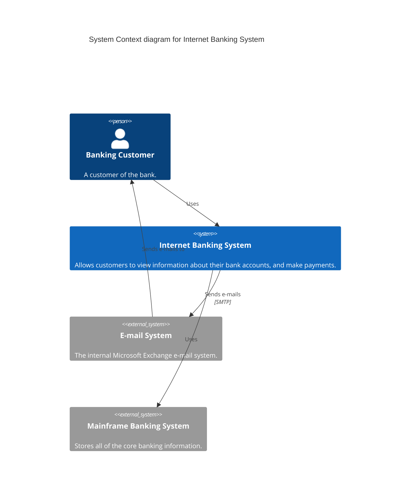
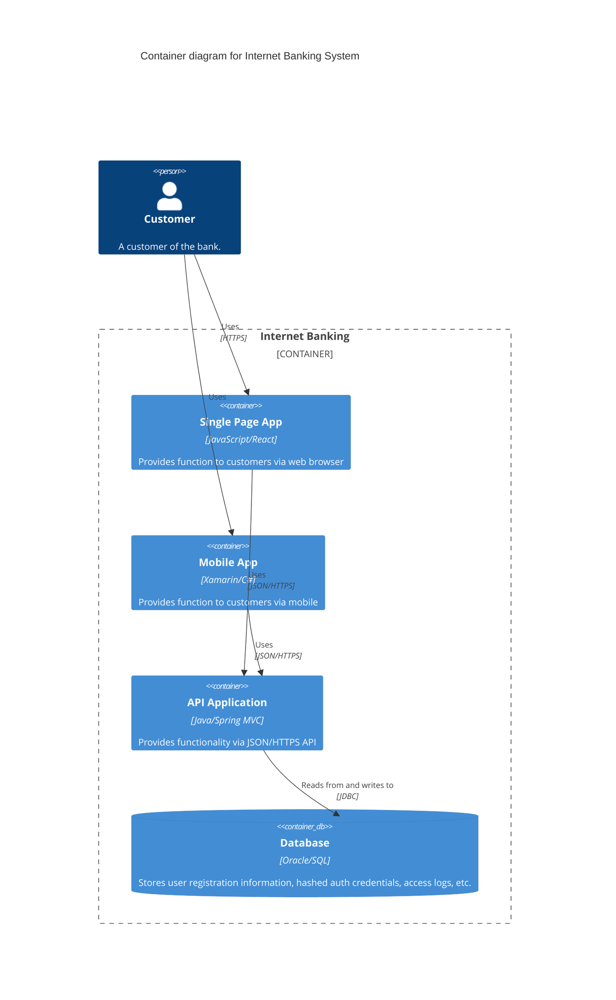
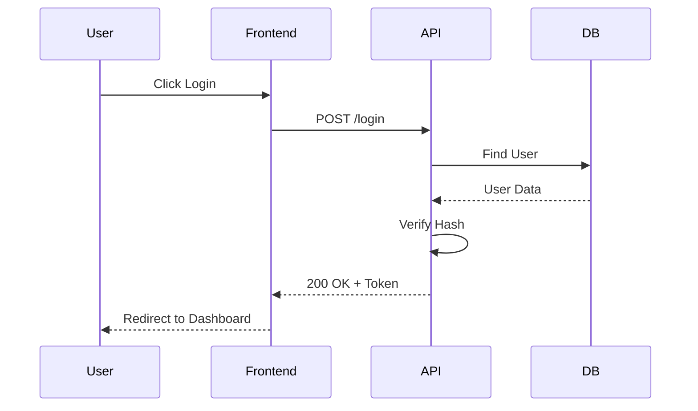
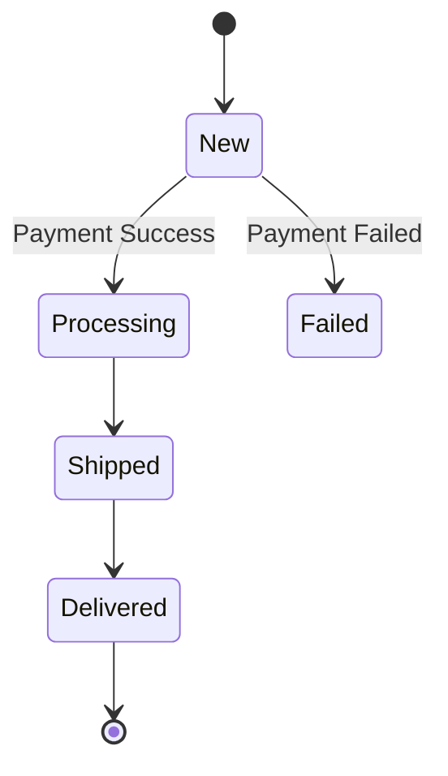

# Architecture Diagrams

## The C4 Model

Visualizing software architecture specifically for different audiences.

### Level 1: System Context
**Audience**: Non-technical stakeholders, Product Owners.
**Shows**: The system in the center, and the users/external systems touching it.
**Example (Mermaid)**:

### Level 2: Container
**Audience**: Architects, Developers, Ops.
**Shows**: Deployable units (Mobile App, API, Database, SPA).
**Example (Mermaid)**:

### Level 3: Component
**Audience**: Developers.
**Shows**: Internal structure of one container (e.g., API classes/modules).

## Sequence Diagrams

**Use for**: showing strict order of operations, especially across network calls.

## State Diagrams

**Use for**: Complex lifecycles (e.g., Order Status, Payment Flow).

