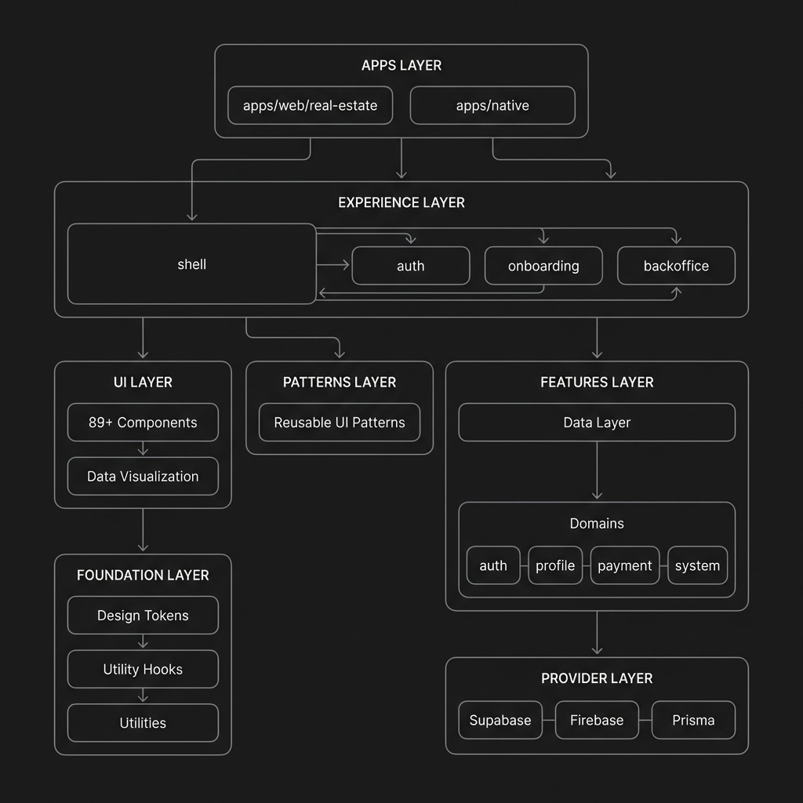
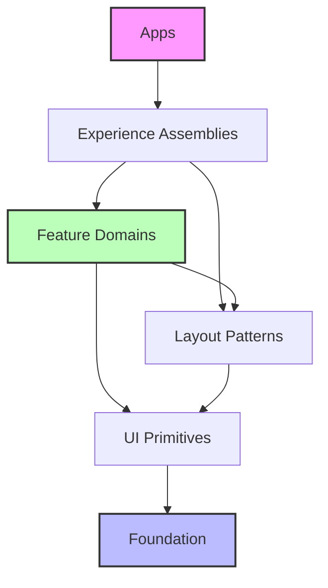
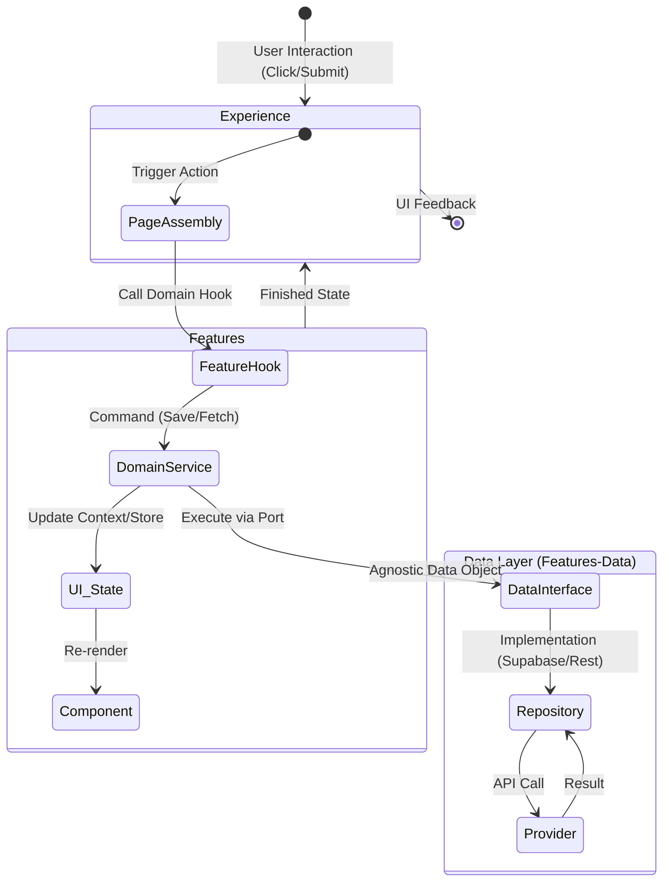
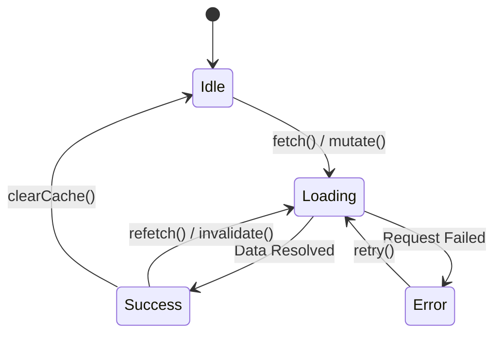
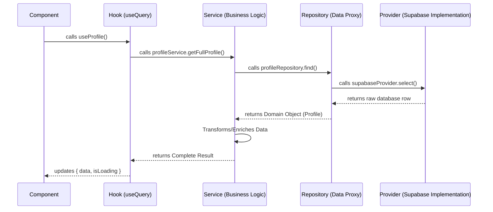
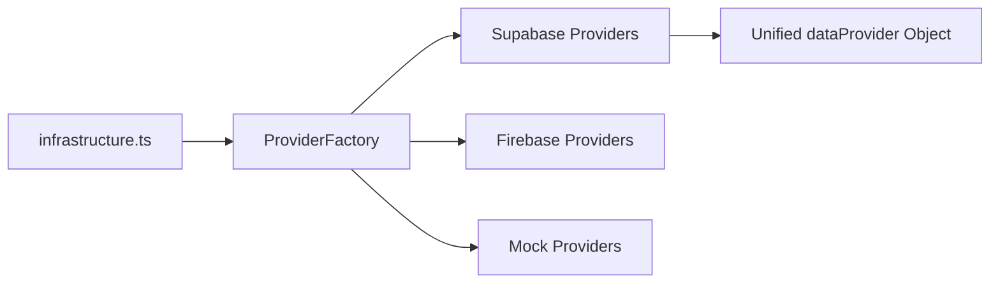

# Pulwave Comprehensive Architecture

> Technical "Source of Truth" for the Pulwave monorepo: principles, layers, standards, and current state.

---

## Architecture Audit Summary

| Metric | Value |
|--------|-------|
| **Overall Score** | **9.7/10** |
| **Circular Dependencies** | ✅ None detected |
| **Test Coverage** | 149+ `__tests__` directories |
| **Domains** | 9 fully atomic |
| **UI Components** | 91 core + charts |
| **Feature Packages** | 16 |
| **Experience Packages** | 7 |

> *Last audited: 2026-01-14*

---

## System Architecture Diagram



---

## 1. High-Level Architecture: Atomic Modular Monorepo

Pulwave is built as an **Atomic Modular Monorepo**. We separate visual primitives (UI) from domain logic (Features) and assembly (Experience).

### The Dependency Flow

Dependencies must always flow **downward**. A lower layer (e.g., UI) cannot import from a higher layer (e.g., Features).



---

## 2. Folder Structure

```
pulwave/
├── apps/
│   └── web/                    # Web applications
│       ├── real-estate/        # Real estate vertical
│       └── restaurant/         # Restaurant vertical
├── packages/
│   ├── entities/               # Provider-agnostic data layer ⭐
│   │   ├── domains/            # Domain modules (auth, profile, payment, etc.)
│   │   ├── providers/          # Database implementations (Supabase)
│   │   └── _infrastructure/    # Caching, infrastructure services
│   ├── shared/                 # Shared utilities and components ⭐
│   │   ├── ui/                 # Component library (91+ components)
│   │   │   ├── components/     # Core UI components
│   │   │   └── data-visualization/ # Charts (cartesian, radial, geo, etc.)
│   │   ├── tokens/             # Design tokens and theme
│   │   ├── hooks/              # Shared React hooks
│   │   ├── utils/              # Utility functions
│   │   ├── security/           # Security utilities
│   │   ├── analytics/          # Analytics tracking
│   │   ├── testing/            # Test utilities
│   │   ├── types/              # Shared TypeScript types
│   │   └── config/             # Configuration utilities
│   ├── widgets/                # Higher-level UI patterns ⭐
│   ├── features/               # Feature modules
│   │   ├── admin/              # Admin features (audit logs, permissions)
│   │   ├── auth/               # Authentication features
│   │   ├── dashboard/          # Dashboard features
│   │   ├── feedback/           # User feedback
│   │   ├── i18n/               # Internationalization
│   │   ├── layout/             # Layout components
│   │   ├── legal/              # Legal pages
│   │   ├── payments/           # Payment features
│   │   ├── properties/         # Property management
│   │   ├── settings/           # User settings features
│   │   ├── shared/             # Shared feature utilities
│   │   ├── social/             # Social features
│   │   ├── subscriptions/      # Subscription management
│   │   └── user/               # User management
│   ├── pages/                  # Page assemblies ⭐
│   │   ├── auth/               # Auth flows
│   │   ├── backoffice/         # Admin backoffice
│   │   ├── dashboard/          # Dashboard assembly
│   │   ├── onboarding/         # Onboarding flows
│   │   ├── shell/              # App shell (sidebar, header)
│   │   └── style-guide/        # Style guide pages
│   ├── integrations/           # External service integrations ⭐
│   │   └── mcp/                # Model Context Protocol
│   └── internal/               # Internal-only packages
│       └── env/                # Environment validation (Zod)
├── docs/                       # Documentation
└── scripts/                    # Build & utility scripts
```

---

## 3. Dynamic State & Data Flow

This diagram illustrates how **State** and **Data** flow through the architectural layers during a user interaction.



### Data Lifecycle State Machine



---

## 4. Layer Definitions

| Layer | Responsibility | Content | Strict Rule |
| :--- | :--- | :--- | :--- |
| **6. Apps** | Orchestration | Main entry points, Environment config, Provider mounting. | Thin shells (max 50 lines per file). |
| **5. Pages**| Assembly | Page compositions, Shell wrappers, Routing. | No direct DB calls or business logic. |
| **4. Features** | Domain Logic | **Atomic Units**: Services, Domain-specific UI, Hooks. | Must be functional in isolation. |
| **3. Widgets** | Composition | Data-agnostic layout recipes (Nav sidebars, Wizard flows). | No domain-specific types. |
| **2. Shared/UI** | Primitives | "Dumb" stateless components. Theme-aware, Accessible. | Purely presentational. |
| **1. Shared/Tokens**| Core DNA | Design tokens (HSL), Global styles, Shared utilities. | No UI components. |
| **0. Entities**| Data Layer | Provider-agnostic data access (Hexagonal Architecture). | Database abstraction only. |

---

## 5. Hexagonal Data Layer

Pulwave uses a **database-agnostic** data strategy in `packages/entities/`.

### 5-Layer Data Architecture

```mermaid
graph TD
    subgraph "External Layers"
        App[Apps / Components]
    end

    subgraph "Data Layer (packages/entities)"
        direction TB
        Hooks[Hooks Layer<br/><i>React Query / State Management</i>]
        Services[Service Layer<br/><i>Business Logic & Orchestration</i>]
        Repos[Repository Layer<br/><i>Data Access Proxies</i>]
        Providers[Provider Layer<br/><i>Implementation (Supabase/REST)</i>]
    end

    App --> Hooks
    Hooks --> Services
    Services --> Repos
    Repos --> Providers
```

### Data Flow Sequence



### Provider Factory Pattern



---

## 6. Domain Inventory

| Domain | Category | Atomic Structure | Hooks | Tests | Status |
| :--- | :--- | :--- | :--- | :--- | :--- |
| **address** | Global | ✅ | 2 | 8 dirs | ✅ Complete |
| **auth** | Global | ✅ | 1 | 9 dirs | ✅ Complete |
| **billing** | Global | ✅ | 2 | 5 dirs | ✅ Complete |
| **feature-flags** | Global | ✅ | 1 | 6 dirs | ✅ Complete |
| **payment** | Global | ✅ | 3 | 7 dirs | ✅ Complete |
| **profile** | Global | ✅ | 10+ | 18 dirs | ✅ Complete |
| **storage** | Global | ✅ | 2 | 2 dirs | ✅ Complete |
| **system** | Global | ✅ | 8 | 4+ dirs | ✅ Complete |
| **translation** | Global | ✅ | 2 | 3 dirs | ✅ Complete |

**Total test directories in data package**: 149

---

## 7. Cross-Cutting Concerns

### 7.1 Audit & Traceability Layer

Location: `packages/features/admin/src/audit-logs/`

| Component | Purpose | Status |
|-----------|---------|--------|
| `useAdminActivityLogs` | Query activity logs | ✅ Exists |
| `useAdminRetention` | Data retention policies | ✅ Exists |
| `RecentActivityTable` | Display audit entries | ✅ Exists |
| `activity_logs` table | Store user actions | ✅ In constants |

### 7.2 Security Layer

Location: `packages/features/settings/`, `packages/features/data/domains/global/auth/`

| Component | Purpose | Status |
|-----------|---------|--------|
| `SecuritySection` | MFA, password management | ✅ Exists |
| `authService` | Session, OTP, password reset | ✅ Exists |
| `permissionsService` | Role-based access | ✅ Exists |
| Rate limiting | API protection | ⚠️ Not implemented |
| Input sanitization | XSS prevention | ⚠️ Not centralized |

### 7.3 Analytics Layer

| Component | Purpose | Status |
|-----------|---------|--------|
| Event tracking | User behavior analytics | ❌ Missing |
| Metrics service | Performance monitoring | ❌ Missing |
| Error tracking | Exception monitoring | ❌ Missing |

---

## 8. UI Component Architecture

### Component Structure (Golden Architecture)

```
packages/shared/ui/components/[Component]/
├── [Component].tsx     # Component implementation
├── index.ts            # Barrel export
├── types.ts            # CVA variants + types
└── styles/
    ├── _index.scss     # Main entry point
    └── partials/       # BEM-based SCSS modules
        ├── _base.scss
        ├── _variants.scss
        ├── _sizes.scss
        ├── _shapes.scss
        ├── _states.scss
        └── _elements.scss
```

### Component Inventory

| Category | Count |
|----------|-------|
| Core Components | 91 |
| Charts - Cartesian | 6+ |
| Charts - Radial | 5+ |
| Charts - Hierarchical | 4+ |
| Charts - Statistical | 2+ |
| Charts - Geo | 2+ |
| **Total** | **110+** |

---

## 9. Atomic Domain Structure

Each domain is a self-contained unit:

```
domains/[domain]/
├── __tests__/            # Unit & Hook tests
├── hooks/                # Public React hooks
│   └── __tests__/        # Hook-specific tests
├── interfaces/           # Agnostic types & contracts
│   ├── types/            # Type definitions
│   │   └── __tests__/    # Type tests
│   └── __tests__/        # Interface tests
├── keys/                 # Query keys for React Query
│   └── __tests__/        # Key tests
├── repositories/         # Domain repositories
│   └── __tests__/        # Repository tests
└── services/             # Business logic & facades
    ├── __tests__/        # Service tests
    └── [subservice]/     # Atomic sub-services
        └── __tests__/    # Sub-service tests
```

---

## 10. Universal & Mobile-First Strategy

Pulwave is designed to be **Universal**. We share logic and design tokens across Web and Native.

1. **Platform Agnostic Tokens**: Shared tokens are exported as JS objects for Native (React Native `StyleSheet`) and CSS variables for Web.
2. **Logic Sharing**: Feature hooks are 100% shared. They contain no DOM or Native-specific code.
3. **Component Overrides**: Primitives can use `.web.tsx` or `.native.tsx` extensions for platform-specific rendering while keeping the same interface.

---

## 11. Detection Rules ("Smell Tests")

1. **Shared/UI Imports Features?** → ❌ Rule violation. Components must be generic.
2. **Pages has `useQuery` with raw SQL?** → ❌ Rule violation. Move to Features.
3. **Feature depends on another Feature's components?** → ❌ Cross-contamination. Move shared parts to `Widgets` or `Shared/UI`.
4. **Supabase import outside `packages/entities/providers/`?** → ❌ Rule violation. Data layer leakage.
5. **Service contains UI concerns?** → ❌ Rule violation. Layer contamination.
6. **Missing `__tests__/` folder in a module?** → ⚠️ Add empty folder for future tests.
7. **Circular dependency detected?** → ❌ Critical violation. Refactor immediately.

---

## 12. Current Validated Status

### ✅ Strengths

| Area | Description | Evidence |
|------|-------------|----------|
| **Circular Dependencies** | None detected in data layer | `madge --circular` verified |
| **Provider Abstraction** | Zero `@supabase/supabase-js` imports in domains | grep verified |
| **Interface-First Design** | All repos implement `I*Repository` interfaces | 9 interfaces defined |
| **Factory Pattern** | Runtime provider switching via `ProviderFactory` | `providers/ProviderFactory.ts` |
| **Single Responsibility** | Each service handles one concern | Atomic sub-services pattern |
| **Test Coverage** | 149+ `__tests__` directories in data package | find verified |
| **CVA Pattern** | Consistent variant handling in UI components | All 91 components |
| **BEM + SCSS Partials** | Modular styling architecture | `styles/partials/_*.scss` |
| **Audit Logs** | Activity tracking exists in admin | `audit-logs/` module |
| **Tooling Packages** | Shared TypeScript, ESLint, Prettier configs | `packages/tooling/` |
| **Env Validation** | Type-safe environment variables with Zod | `packages/internal/env/` |
| **CI/CD Pipeline** | GitHub Actions with typecheck, lint, build | `.github/workflows/ci.yml` |
| **Pre-commit Hooks** | Husky + lint-staged for code quality | `.husky/pre-commit` |

### ⚠️ Current Gaps

| Area | Gap | Impact |
|------|-----|--------|
| **Analytics Layer** | No event tracking, metrics, or error monitoring | Cannot trace user behavior |
| **Rate Limiting** | No API-level rate limiting | Security risk |
| **Input Sanitization** | Not centralized | XSS risk |
| **TypeScript Errors** | 50+ errors in style-guide package | Build failures |
| **Missing package.json** | backoffice, payments experience packages | Workspace issues |

---

*Part of the Pulwave Design System • Last updated: 2026-01-14*
